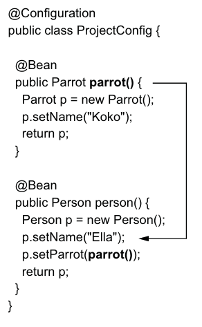

# 6장: 스프링 AOP

DI외 스프링이 지원하는 강력한 기능 중 Asepct가 있다. aspect는 프레임워크가 메서드 호출을 가로채고, 메서드 실행을 변경하는 방법이다. 이를 통해 실행중이 메서드의 일부 로직을 추출할 수 있다. Aspect는 신중히 사용치 않으면 앱의 유지보수가 어려워질 수 있다. 이런 접근 방식으로 Aspect-Oriented Programming(AOP)라고 한다.

Aspect를 배우는 이유는 AOP를 통해서 스프링이 제공하는 트랙젝션 처리나 보안설정 같은 중요한 기능을 이용할 수 있기 때문이다. 그 이전에 Aspect에 관해서 알아야 한다.

aspect는 프레임워크가 특정 메소드를 호출할 때 실행하는 로직의 일부이다. aspect를 설계 시 다음의 항목을 정의한다.

1. **어떤 코드를 실행할까?** 이 코드가 **aspect**다.
2. **해당 로직을 언제 실행할까?** 예를 들어서 메서드 호출 전? 후? 대신에? 이를 **advice**라고 한다.
3. **어떤 메소드**에 프레임워크가 aspect를 적용해야 하나? 이를 **pointcut**이라고 한다.

**join point**란? aspect가 실행되는 이벤트.. 스프링에서는 이 이벤트는 항상 메서드 호출이다.

**aspect target**이 되려면 우선 스프링에서 관리해야 한다. 따라서 bean이어야 한다.

<figure><figcaption>
figure 6.2
</figcaption></figure>

객체가 aspect target으로 지정된다면 getBean() 메소드나 DI를 통해서 빈이 사용될때마다 spring은 실제 메서드 대신 aspect 로직을 호출하는 객체를 반환한다. \
이런 객체를 **프록시 객체**라고 한다. 또한 이런 접근 방식을 **Weaving**이라고 한다.

**aspect 사용하기**

1. aspects을 허용하기 구성 클래스위에 허용 주석을 단다. ex) @EnableAspectJAutoProxy
2. aspect를 정의하는 클래스를 스프링 컨텍스트에 추가한다. 이 클래스 내부에 함수를 정의할 것이다. 클래스우에는 @Aspect 주석을 달아준다. 중요한 점은 이 주석만으로 자동으로 컨텍스트에 추가되지 않는다는 것이다.
3. 언제&어디서 함수를 대체할 것인지 스프링에게 알려준다. 이때 advice 주석을 사용한다. ex) @Around 주석 안에는 어떤 타겟함수의 특징을 AspectJ 문법으로 서술해야 한다. 또한 주석처리된 함수는 ProceedingJoinPoint 타입의 매개변수를 받는데, 이것이 타겟함수다.
4. 로직 실행

<figure><figcaption>
figure 6.6: aspectJ 문구 
</figcaption></figure>

특정 메서드를 실행하기 전에 인증절차등이 우선되어야 하는 로직의 경우 용이하다. 또한 proceed() 호출 시 가로챈 메서드에서 에러가 발생하면 예외처리도 가능하다.

<figure><figcaption>
figure 6.11: aspect 전체 흐름
</figcaption></figure>

aspect는 가로챈 함수의 리턴값, 파라미터 등도 바꿀 수 있다. 즉 굉장히 강력한 기능을 제공하기 때문에 조심히 사용해야한다. 어디까지나 로직을 디커플링하는 이유는 코드의 중복과 불필요한 정보를 숨기기위한 것이다.

커스텀 주석을 만들어서 복잡한 AspectJ 안쓰고 원하는 타겟 메서드에 주석만 갖다 쓰는 방법도 있다.

<figure><figcaption>
figure 6.12: 커스텀 주석 만들어서 쓰기
</figcaption></figure>

**advice 주석 종류** \
@Around 외에도

1. @Before: 메서드가 실행되기전 로직 실행.
2. @AfterReturning: 메서드가 성공적으로 반환후 로직 실행. 반환값이 파라미터로 제공됨. 에러 발생 시 실행 안됨.
3. @AfterThrowing: 메서드가 예외 발생 시 로직 실행. 예외 인스턴스가 파라미터로 제공됨.
4. @After: 메서드 실행 후 로직 실행. 성공이나 예외 상관없이 실행됨.

이때까지 하나의 메서드를 하나의 에스펙트가 인터셉트하는 상황만 다루었지만, 실제 개발환경에서는 하나의 메서드를 여러 에스펙트가 인터셉트하는 경우가 많다. 이때 두 가지 질문이 제기된다.

1. 애스펙트간 어떤 순서로 인터셉트하는가?
2. 순서가 중요한가?

실행순서가 중요하지 않다면 그대로 두면 되지만, 만약 순서가 중요한 로직이라면 @Order 주석을 사용해서 애스펙트간의 순서를 명시적으로 정의한다. 숫자가 작을수록 해당 애스펙트가 더 먼저 실행된다.

또한 다수의 애스팩트가 실행될때 proceed()로 다음 애스팩트 또는 타겟함수로 넘어가게 된다.

<figure><figcaption>
figure 6.6: aspect chain example
</figcaption></figure>
